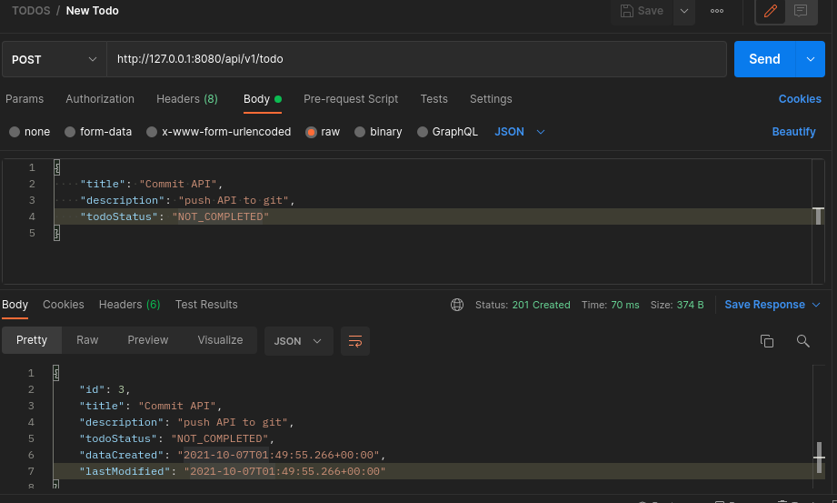
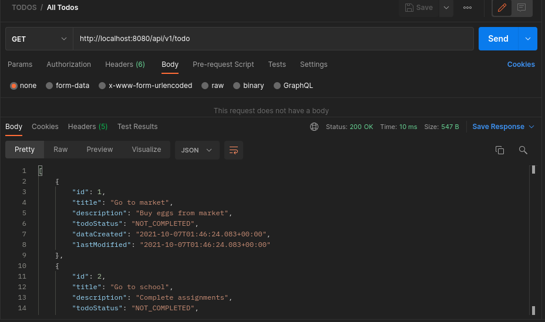
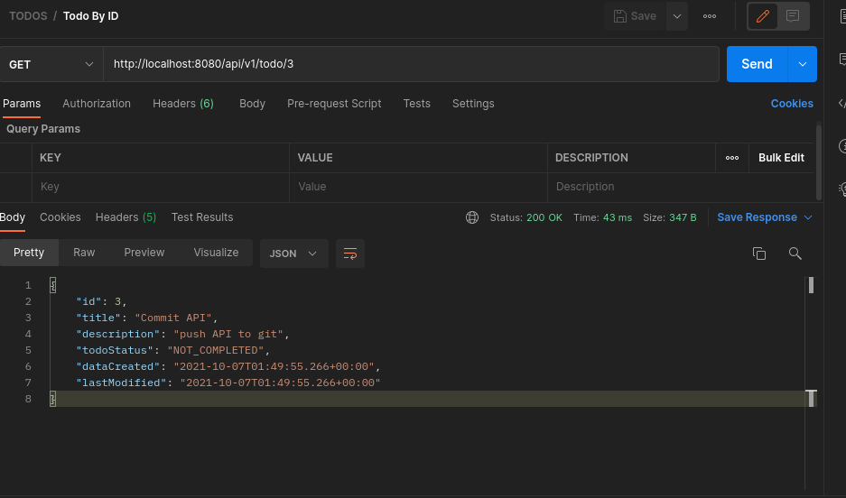
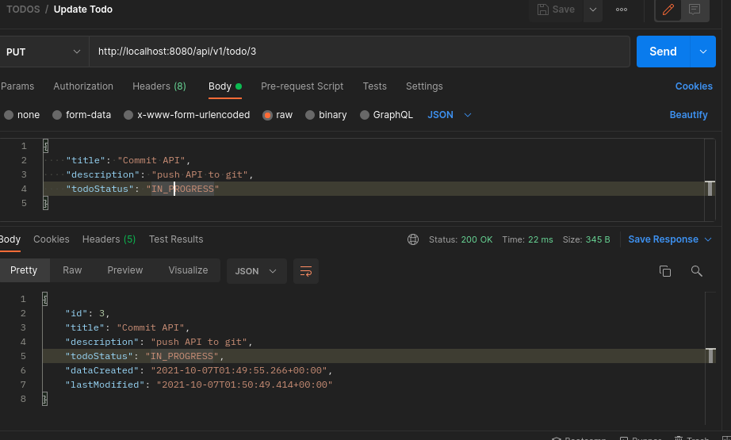
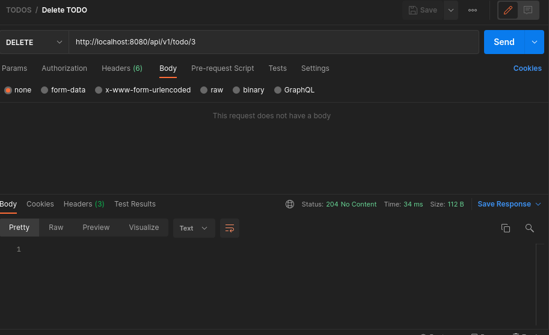

# API TODOs
## CRUD
### End Points:
 

 **Novos TODOs:**

 Faca uma requisicao POST e envie o JSON abaixo:

 http://localhost:8080/api/v1/todo

 ``{
   "title": "Estudar JAVA",
   "description: "Estudar sobre ENUMs",
   "todoStatus": "NOT_COMPLETED"
 }``

 
 

  
 

 
**Lista com TODOs criados:**

Faca uma requisicao GET com o endereco:

http://localhost:8080/api/v1/todo

 

  
 

 
**Exibindo TODO por ID:**

Faca uma requisicao GET usando:

http://localhost:8080/api/v1/todo/{id}

 

  
 

 

**Atualizando um TODO:**

Faca uma requisicao PUT:

http://localhost:8080/api/v1/todo/{id}

 ``{
   "title": "Estudar JAVA",
   "description: "Estudar sobre ENUMs",
   "todoStatus": "IN_PROGRESS"
 }``

 

  
 

 

**Deletando TODO:**

Faca uma requisicao DELETE:
http://localhost:8080/api/v1/todo/{id}

 

  
 

 
 
 ## Rodando:

Clone este repositório:
- ``https://github.com/redmasters/crud-api.git ``
- ``cd crud-api/crud-api/``
- ``$GRADLE_PATH/bin/gradle bootRun``

## 🚀 Tecnologias:
- Java 8
- Spring Boot
- Gradle 7.2

## 🖌️ Editores:
- IntelliJ IDEA
- Postman